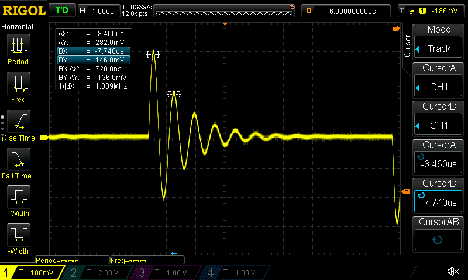

# rigol-mcp

MCP server for controlling a **Rigol DS1000Z series oscilloscope** over LAN. Exposes the scope as a set of tools that Claude (or any MCP client) can call to take measurements, configure the instrument, and capture screenshots — entirely through natural language.



## Supported Hardware

**Rigol DS1000Z / MSO1000Z series:**

| Model | Channels | Notes |
|---|---|---|
| DS1054Z | 4 analog | Most common, 50 MHz |
| DS1074Z | 4 analog | 70 MHz |
| DS1074Z-S | 4 analog + signal gen | |
| DS1104Z | 4 analog | 100 MHz |
| DS1104Z-S | 4 analog + signal gen | |
| MSO1054Z | 4 analog + 16 digital | MSO variant |
| MSO1074Z | 4 analog + 16 digital | |
| MSO1104Z | 4 analog + 16 digital | |

The scope must be connected to your **local network via Ethernet** (rear panel RJ45). Wi-Fi is not supported by this hardware. USB-VISA is not currently supported — LAN only.

## Requirements

- Python 3.11+
- [uv](https://docs.astral.sh/uv/) (recommended) or pip
- Rigol DS1000Z on the same LAN as your computer
- SCPI over TCP/IP enabled on the scope (it is by default)

## Installation

```bash
git clone https://github.com/erebusnz/rigol-mcp
cd rigol-mcp
uv sync
```

## Scope Network Setup

On the scope, go to **Utility → IO Setting → LAN** and note the IP address (or assign a static one). The scope listens on **port 5555** for raw SCPI commands — no additional configuration is needed.

Verify connectivity before using:

```bash
python -c "import pyvisa; rm = pyvisa.ResourceManager(); s = rm.open_resource('TCPIP0::192.168.1.47::5555::SOCKET'); s.write_termination='\n'; s.read_termination='\n'; print(s.query('*IDN?'))"
```

You should see something like:
```
RIGOL TECHNOLOGIES,DS1054Z,DS1ZA123456789,00.04.04.SP4
```

## Configuration

Set the scope IP via environment variable:

```bash
export RIGOL_IP=192.168.1.47
```

Or create a `.env` file (copy from `.env.example`):

```
RIGOL_IP=192.168.1.47
```

**Optional:**

| Variable | Default | Description |
|---|---|---|
| `RIGOL_IP` | (required) | Scope IP address |
| `RIGOL_SCREENSHOT_DIR` | `screenshots/` | Directory for saved PNG screenshots |

## Claude Desktop / Claude Code Setup

Add to your `.mcp.json` (or Claude Desktop MCP config):

```json
{
  "mcpServers": {
    "rigol": {
      "command": "uv",
      "args": ["run", "rigol-mcp"],
      "cwd": "/path/to/rigol-mcp",
      "env": {
        "RIGOL_IP": "192.168.1.47"
      }
    }
  }
}
```

## Tools

### Identification & State

| Tool | Description |
|---|---|
| `idn` | Identify the instrument — make, model, serial, firmware |
| `get_scope_state` | Snapshot of all channel configs, timebase, and trigger settings |

### Acquisition Control

| Tool | Description |
|---|---|
| `run` | Start continuous acquisition |
| `stop` | Stop and freeze display |
| `single` | Arm for one trigger event, then stop |
| `autoscale` | Auto-configure timebase, vertical scale, and trigger |

### Configuration

| Tool | Description |
|---|---|
| `set_channel` | Set scale (V/div), offset, coupling (AC/DC/GND), probe ratio, on/off |
| `set_timebase` | Set time/div and trigger offset |
| `set_trigger` | Configure edge trigger: source, slope (POS/NEG/RFAL), level |

### Measurement

| Tool | Description |
|---|---|
| `measure` | Query any single-channel measurement: VMAX, VMIN, VPP, VRMS, FREQUENCY, PERIOD, PWIDTH, NWIDTH, PDUTY, NDUTY, RTIME, FTIME, OVERSHOOT, PRESHOOT, and more |
| `measure_between` | Query delay or phase between two channels: RDELAY, FDELAY (seconds), RPHASE, FPHASE (degrees) |
| `get_waveform` | Download and analyse waveform data (~1200 points); returns text analysis by default, raw time/voltage arrays with `raw_data=true` |

### Cursors

| Tool | Description |
|---|---|
| `set_cursors` | Set cursor mode (MANUAL/TRACK/OFF) and time positions in seconds |
| `get_cursor_values` | Read cursor positions (in seconds) and all delta/amplitude readouts |

### Utility

| Tool | Description |
|---|---|
| `screenshot` | Capture display as PNG — returns image inline and saves to disk |
| `send_raw` | Send any SCPI command directly (escape hatch) |
| `check_error` | Query the SCPI error queue |

## Example Prompts

**Basic measurement session:**
> "Connect to the scope, check what's configured, then measure the frequency and Vpp on channel 1."

**Signal characterisation:**
> "Stop the scope, download the waveform from channel 2, and tell me the rise time, overshoot percentage, and estimated fundamental frequency."

**Setup from scratch:**
> "Set channel 1 to 2V/div DC coupling with a 10x probe, set the timebase to 1ms/div, trigger on channel 1 rising edge at 1V, then run and take a screenshot."

**Cursor measurement:**
> "Put manual cursors on the first rising edge of the signal on channel 1 — cursor A at the 10% level and cursor B at the 90% level — and read the rise time from the delta."

**Iterative debugging:**
> "I'm verifying the gain of an amplifier. Channel 1 is the input, channel 2 is the output. The expected gain is 20 dB. Figure out whether it's within spec."

**Unknown signal characterisation:**
> "There's an unfamiliar signal on channel 1. I don't know its frequency, amplitude, or shape. Keep adjusting the timebase and vertical scale until you have a stable, well-framed view of at least two full cycles, then give me a complete characterisation of what you see."

## Architecture

```
Claude / MCP client
        │  MCP protocol (stdio)
rigol_mcp.server      ← tool definitions, request routing
        │  Python function calls
rigol_mcp.scope       ← VISA connection, SCPI command helpers
        │  SCPI over TCP/IP (port 5555)
Rigol DS1000Z         ← 192.168.1.47
```

The VISA connection is cached across tool calls (one TCP connection per server session) and reconnects automatically on network errors.

## SCPI Transport

The server connects using **raw socket VISA** (`TCPIP0::<ip>::5555::SOCKET`), not VXI-11. This avoids the NI-VISA dependency and works with the pure-Python `pyvisa-py` backend. It also eliminates the VXI-11 handshake overhead, making individual commands faster.

## Limitations

- LAN only (no USB) - USB just adds more problems and OS-specific implementation challenges!
- No support for math channels, digital channels (MSO), or protocol decode in the current tools yet — use `send_raw` for those
- Waveform download uses NORMAL mode (screen buffer, ~1200 points); full memory depth (RAW mode, up to 56M points) is not yet implemented