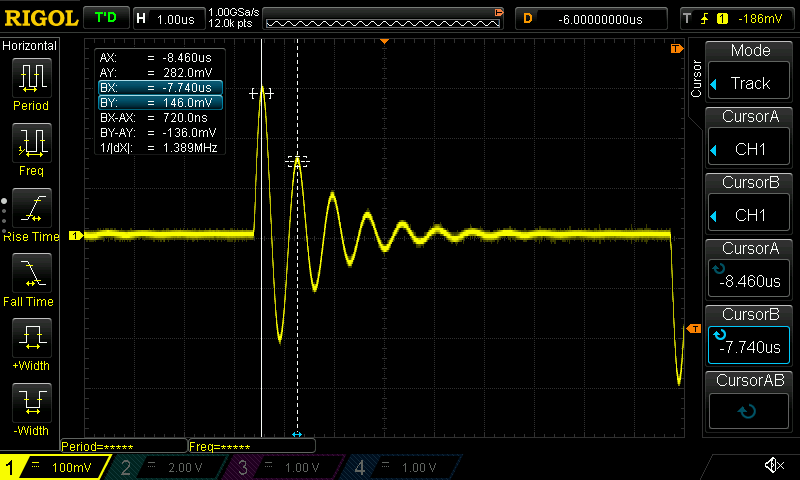
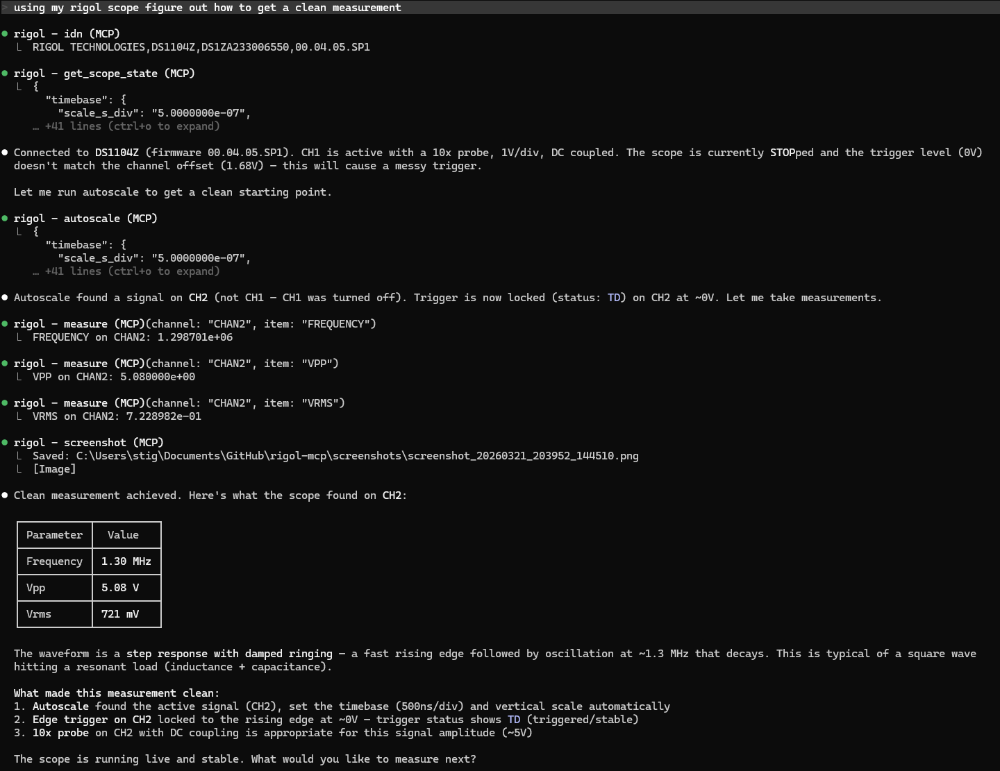

# rigol-mcp

MCP server for controlling a **Rigol DS1000Z series oscilloscope** over LAN or USB. Exposes the scope as a set of tools that Claude (or any MCP client) can call to take measurements, configure the instrument, and capture screenshots — entirely through natural language.



### Example: unknown signal characterisation in Claude

Unknown signal (square wave into LCR trap), wrong channel enabled, invalid timebase/voltage/trigger. Claude identifies the signal type, corrects the setup, and characterises the waveform.



## Supported Hardware

**Rigol DS1000Z / MSO1000Z series:**

| Model | Channels | Notes |
|---|---|---|
| DS1054Z | 4 analog | Most common, 50 MHz |
| DS1074Z | 4 analog | 70 MHz |
| DS1074Z-S | 4 analog + signal gen | |
| DS1104Z | 4 analog | 100 MHz |
| DS1104Z-S | 4 analog + signal gen | |
| MSO1054Z | 4 analog + 16 digital | MSO variant |
| MSO1074Z | 4 analog + 16 digital | |
| MSO1104Z | 4 analog + 16 digital | |

The scope connects either over your **local network via Ethernet** (rear panel RJ45) or over **USB** (rear panel USB-B device port). LAN is the default; USB is used when `RIGOL_USB` is set (see [Configuration](#configuration)).

## Requirements

- Python 3.11+
- [uv](https://docs.astral.sh/uv/)
- A Rigol DS1000Z connected over **LAN** (same network) or **USB**
- For LAN: SCPI over TCP/IP enabled on the scope (on by default)
- For USB: a VISA driver on the scope's USB interface — either the native USBTMC driver
  (e.g. from Rigol UltraSigma / any NI-VISA runtime) or WinUSB via Zadig
  (see [USB connection](#usb-connection))

## Installation

```bash
git clone https://github.com/erebusnz/rigol-mcp
cd rigol-mcp
uv sync
```

## Scope Network Setup

On the scope, go to **Utility → IO Setting → LAN** and note the IP address (or assign a static one). The scope listens on **port 5555** for raw SCPI commands — no additional configuration is needed.

*Replace 192.168.1.123 with the IP address of your scope in all instructions below.*

Verify in browser: `http://192.168.1.123/DS1000Z_WelcomePage.html`

Verify connectivity before using as MCP:

```bash
python -c "import pyvisa; rm = pyvisa.ResourceManager('@py'); s = rm.open_resource('TCPIP0::192.168.1.123::5555::SOCKET'); s.write_termination='\n'; s.read_termination='\n'; print(s.query('*IDN?'))"
```

You should see something like:
```
RIGOL TECHNOLOGIES,DS1054Z,DS1ZA123456789,00.04.04.SP4
```

## Configuration

Set the scope IP for MCP via environment variable:

```bash
export RIGOL_IP=192.168.1.123
```

Or create a `.env` file (copy from `.env.example`):

```
RIGOL_IP=192.168.1.123
```

**Optional:**

| Variable | Default | Description |
|---|---|---|
| `RIGOL_IP` | (required for LAN) | Scope IP address |
| `RIGOL_USB` | (unset) | Set to `1` to connect over USB instead of LAN. The first Rigol USB scope is found automatically. |
| `RIGOL_USB_SERIAL` | (unset) | When several Rigol scopes are on USB, pin a specific one by serial number. |
| `RIGOL_SCREENSHOT_DIR` | `screenshots/` | Directory for saved PNG screenshots |

### USB connection

Set `RIGOL_USB=1` to connect over USB instead of LAN. The server looks for a Rigol scope
on USB (vendor ID `0x1AB1`) and connects to it. If more than one scope is connected, set
`RIGOL_USB_SERIAL` to choose which one by serial number.

```
RIGOL_USB=1
# RIGOL_USB_SERIAL=DS1ZA000000000   # only needed if more than one scope is on USB
```

#### Windows USB instructions

The scope's USB interface needs a VISA-compatible driver. The server **auto-detects**
whichever you have installed — pick one:

**Option A — install the WinUSB driver with Zadig.** The server talks to the scope through
the bundled pure-Python `pyvisa-py` (`@py`) backend (`pyusb` + `libusb`); no extra Rigol
software needed. Do this once per scope:

1. Connect the scope over USB and power it on.
2. Download and run [Zadig](https://zadig.akeo.ie/).
3. Choose **Options → List All Devices**.
4. Select **"DS1000Z Series"** in the device dropdown.
5. Set the target driver to **WinUSB** and click **Install Driver** (or **Replace Driver**).
6. Wait for "The driver was installed successfully", then set `RIGOL_USB=1`.

**Option B — install Rigol UltraSigma, which bundles the driver.**
[UltraSigma](https://www.rigol.com) installs the standard *"USB Test and Measurement
Device"* (USBTMC) driver. Once it's installed, the server reaches the scope through the
NI-VISA (`@ivi`) backend — nothing else to configure.

> **Note:** the two drivers are mutually exclusive on a given USB interface. Installing
> WinUSB (Option A) means UltraSigma can no longer see the scope over USB until you revert
> the driver in Device Manager, and vice versa. LAN access is unaffected either way.

#### Linux / macOS USB

Works without needing drivers using the `pyvisa-py` (`@py`) backend.

- **macOS:** typically works as-is once `RIGOL_USB=1` is set; no driver to install.
- **Linux:** give your user permission to claim the device with a udev rule, then replug it:

  ```
  # /etc/udev/rules.d/60-rigol.rules
  SUBSYSTEM=="usb", ATTRS{idVendor}=="1ab1", MODE="0660", GROUP="plugdev"
  ```
  ```bash
  sudo udevadm control --reload-rules && sudo udevadm trigger
  ```

  (Make sure your user is in the `plugdev` group: `sudo usermod -aG plugdev $USER`, then log out and back in.)

  If the kernel's `usbtmc` module has already claimed the scope, unbind or blacklist it so
  `libusb` can take the interface — pyvisa-py does not detach it automatically.

> USB is currently hardware-tested on Windows only; Linux/macOS use the standard `libusb`
> setup above.

## Claude Desktop / Claude Code Setup

Add to your `.mcp.json` (or Claude Desktop MCP config):

```json
{
  "mcpServers": {
    "rigol": {
      "command": "uv",
      "args": ["run", "rigol-mcp"],
      "cwd": "/path/to/rigol-mcp",
      "env": {
        "RIGOL_IP": "192.168.1.123"
      }
    }
  }
}
```

For **USB**, replace the `RIGOL_IP` entry in `env` with `"RIGOL_USB": "1"` (see [USB connection](#usb-connection)).

## Tools

### Identification & State

| Tool | Description |
|---|---|
| `idn` | Identify the instrument — make, model, serial, firmware |
| `get_scope_state` | Snapshot of all channel configs, timebase, and trigger settings |

### Acquisition Control

| Tool | Description |
|---|---|
| `run` | Start continuous acquisition |
| `stop` | Stop and freeze display |
| `single` | Arm for one trigger event, then stop |
| `autoscale` | Auto-configure timebase, vertical scale, and trigger |

### Configuration

| Tool | Description |
|---|---|
| `set_channel` | Set scale (V/div), offset, coupling (AC/DC/GND), probe ratio, on/off |
| `set_timebase` | Set time/div and trigger offset |
| `set_trigger` | Configure edge trigger: source, slope (POS/NEG/RFAL), level |

### Measurement

| Tool | Description |
|---|---|
| `measure` | Query any single-channel measurement: VMAX, VMIN, VPP, VTOP, VBASE, VAMP, VAVG, VRMS, PVRMS, VUPPER, VMID, VLOWER, VARIANCE, FREQUENCY, PERIOD, PWIDTH, NWIDTH, PDUTY, NDUTY, RTIME, FTIME, OVERSHOOT, PRESHOOT, PSLEWRATE, NSLEWRATE, TVMAX, TVMIN, MAREA, MPAREA, PPULSES, NPULSES, PEDGES, NEDGES |
| `measure_between` | Query delay or phase between two channels: RDELAY, FDELAY (seconds), RPHASE, FPHASE (degrees) |
| `get_waveform` | Download and analyse waveform data (~1200 points); returns text analysis by default, raw time/voltage arrays with `raw_data=true` |

### Cursors

| Tool | Description |
|---|---|
| `set_cursors` | Set cursor mode (MANUAL/TRACK/OFF) and time positions in seconds |
| `get_cursor_values` | Read cursor positions (in seconds) and all delta/amplitude readouts |

### Utility

| Tool | Description |
|---|---|
| `screenshot` | Capture display as PNG — returns image inline and saves to disk |
| `send_raw` | Send any SCPI command directly (escape hatch) |
| `check_error` | Query the SCPI error queue |

## Example Prompts

**Basic measurement session:**
> "Connect to the scope, check what's configured, then measure the frequency and Vpp on channel 1."

**Signal characterisation:**
> "Stop the scope, download the waveform from channel 2, and tell me the rise time, overshoot percentage, and estimated fundamental frequency."

**Setup from scratch:**
> "Set channel 1 to 2V/div DC coupling with a 10x probe, set the timebase to 1ms/div, trigger on channel 1 rising edge at 1V, then run and take a screenshot."

**Cursor measurement:**
> "Put manual cursors on the first rising edge of the signal on channel 1 — cursor A at the 10% level and cursor B at the 90% level — and read the rise time from the delta."

**Transient / ringing characterisation:**
> "There's a damped oscillation on channel 1 after a step edge. Stop the scope, measure Vpp, Vmax, Vmin, and Vrms, then estimate the ring frequency and how many cycles it takes to decay."

**Iterative debugging:**
> "I'm verifying the gain of an amplifier. Channel 1 is the input, channel 2 is the output. The expected gain is 20 dB. Figure out whether it's within spec."

**Unknown signal characterisation:**
> "There's an unfamiliar signal on channel 1. I don't know its frequency, amplitude, or shape. Keep adjusting the timebase and vertical scale until you have a stable, well-framed view of at least two full cycles, then give me a complete characterisation of what you see."

## Architecture

```
Claude / MCP client
        │  MCP protocol (stdio)
rigol_mcp.server      ← tool definitions, request routing
        │  Python function calls
rigol_mcp.scope       ← VISA connection, SCPI command helpers
        │  SCPI over TCP/IP (port 5555) or USBTMC
Rigol DS1000Z         ← 192.168.1.123  /  USB
```

The VISA connection is cached across tool calls (one connection per server session) and reconnects automatically on communication errors.

## SCPI Transport

By default the server connects using **raw socket VISA** (`TCPIP0::<ip>::5555::SOCKET`), not VXI-11. This avoids the NI-VISA dependency and works with the pure-Python `pyvisa-py` backend. It also eliminates the VXI-11 handshake overhead, making individual commands faster.

When `RIGOL_USB` is set, the server instead connects over **USBTMC** (`USB0::0x1AB1::<model>::<serial>::INSTR`), discovering the scope automatically. It auto-selects whichever VISA backend can see the scope:

- **`@py`** (`pyvisa-py` + `pyusb` + bundled `libusb`) — for a USB interface bound to **WinUSB** (no NI-VISA needed).
- **`@ivi`** (NI-VISA / IVI VISA) — for the **native USBTMC driver** (e.g. installed with Rigol UltraSigma).

The two backends frame USBTMC reads differently, so block reads (waveform/screenshot) are read by exact byte count on `@py` and via native message reads (`read_raw`) on `@ivi`. Transport and backend selection live in `rigol_mcp.scope.get_scope` / `_open_usb_scope`.

## Testing

Unit tests are fully offline — the VISA layer is faked, so no instrument is required.

```bash
uv run --extra test pytest      # or: uv sync --extra test && uv run pytest
```

## Limitations

- USB driver setup is platform-specific: **Windows** needs WinUSB (via Zadig) or NI-VISA/UltraSigma; **Linux** needs `libusb` access (a udev rule) or NI-VISA; **macOS** typically works through `libusb` with no setup. The server auto-detects the backend — see [USB connection](#usb-connection). LAN needs no driver setup on any platform.
- No support for math channels, digital channels (MSO), or protocol decode in the current tools yet — use `send_raw` for those
- Waveform download uses NORMAL mode (screen buffer, ~1200 points); full memory depth (RAW mode, up to 56M points) is not yet implemented

## License

MIT — see [LICENSE](LICENSE).
